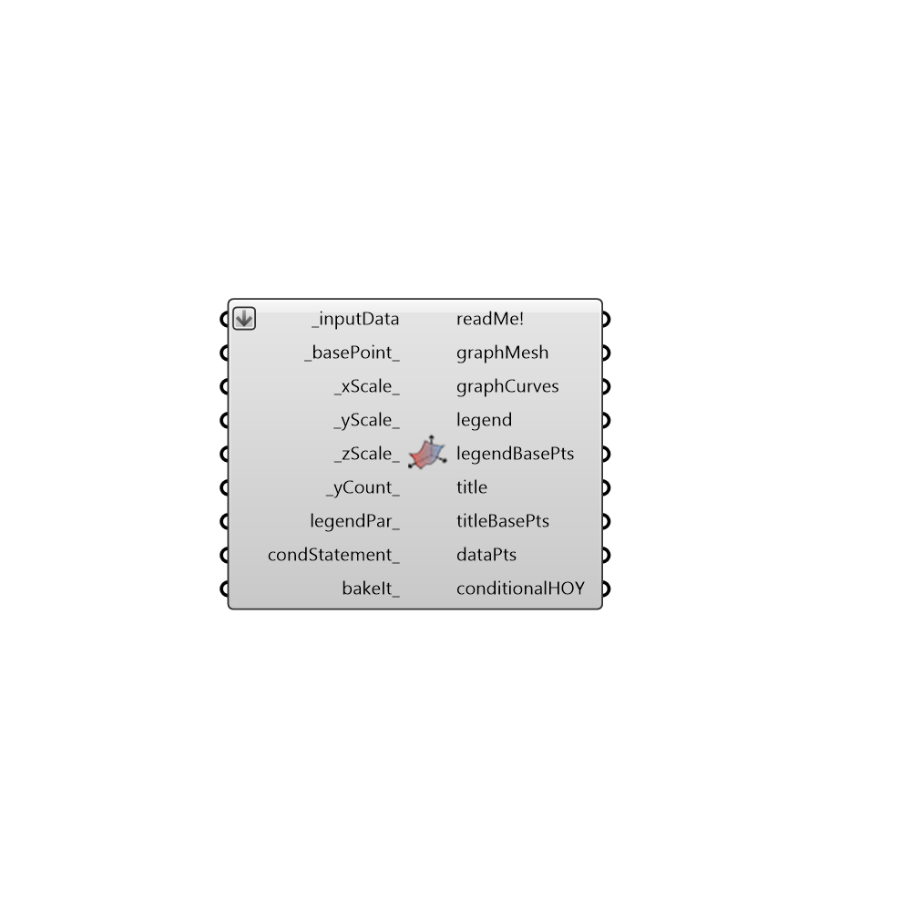

##  3D Chart - [[source code]](https://github.com/mostaphaRoudsari/ladybug/tree/master/src/Ladybug_3D%20Chart.py)

Use this component to make a 3D chart in the Rhino scene of any climate data or hourly simulation data.
 -
 

#### Inputs
* ##### inputData [Required]
A list of input data to plot.
* ##### basePoint [Default]
An optional point with which to locate the 3D chart in the Rhino Model.  The default is set to the Rhino origin at (0,0,0).
* ##### xScale [Default]
The scale of the X axis of the graph. The default will plot the X axis with a length of 3650 Rhino model units (for 365 days of the year). Connect a list of values for multiple graphs.
* ##### yScale [Default]
The scale of the Y axis of the graph. The default will plot the Y axis with a length of 240 Rhino model units (for 24 hours of the day). Connect a list of values for multiple graphs.
* ##### zScale [Default]
The scale of the Z axis of the graph. The default will plot the Z axis with a number of Rhino model units corresponding to the input data values.  Set to 0 to see graphCurves appear on top of the mesh.  Connect a list of values for multiple graphs.
* ##### yCount [Default]
The number of segments on your y-axis.  The default is set to 24 for 24 hours of the day. This variable is particularly useful for input data that is not for each hour of the year.
* ##### legendPar [Optional]
Optional legend parameters from the Ladybug Legend Parameters component.
* ##### condStatement [Optional]
An optional conditional statement, which will remove data from the chart that does not fit the conditions. The input must be a valid python conditional statement (e.g. a > 25).
* ##### bakeIt [Optional]
An integer that tells the component if/how to bake the bojects in the Rhino scene.  The default is set to 0.  Choose from the following options:
 0 (or False) - No geometry will be baked into the Rhino scene (this is the default).
 1 (or True) - The geometry will be baked into the Rhino scene as a colored hatch and Rhino text objects, which facilitates easy export to PDF or vector-editing programs.
 2 - The geometry will be baked into the Rhino scene as colored meshes, which is useful for recording the results of paramteric runs as light Rhino geometry.

#### Outputs
* ##### readMe!
...
* ##### graphMesh
A 3D plot of the input data as a colored mesh.  Multiple meshes will be output for several input data streams or graph scales.
* ##### graphCurves
A list of curves and text surfaces representing the time periods corresponding to the input data.  Note that if the time period of the input data is not clear, no curves or labels will be generated here.
* ##### legend
A legend of the chart. Connect this output to a grasshopper "Geo" component in order to preview the legend in the Rhino scene.g
* ##### legendBasePts
The legend base point, which can be used to move the legend in relation to the chart with the native rasshopper "Move" component.
* ##### title
The title text of the chart.  Hook this up to a native Grasshopper 'Geo' component to preview it separately from the other outputs.
* ##### titleBasePts
Points for placement of the title and axes labels of the chart, which can be used to move these text items in relation to the chart with the native Grasshopper "Move" component.
* ##### dataPts
Points representing the location of each piece of data on the chart.  Use this to label the points of the chart with text lables using a native grasshopper "Text Tag" component.
* ##### conditionalHOY
The input data for the hours of the year that pass the conditional statement.

[Check Hydra Example Files for 3D Chart](https://hydrashare.github.io/hydra/index.html?keywords=Ladybug_3D Chart)