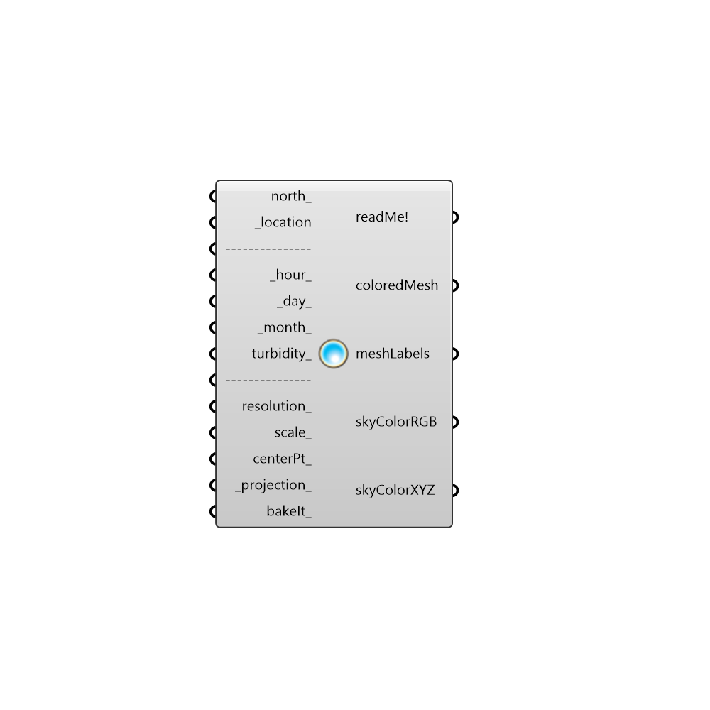

##  Colored Sky Visualizer - [[source code]](https://github.com/ladybug-tools/ladybug-legacy/tree/master/src/Ladybug_Colored%20Sky%20Visualizer.py)

Use this component to visualize a Perez sky as a colored mesh in the Rhino scene using the weather file location, a time and date, and an estimate of turbidity (or amount of particulates in the atmosphere.
 -
 

#### Inputs
* ##### north [Optional]
Input a vector to be used as a true North direction for the sky dome or a number between 0 and 360 that represents the degrees off from the y-axis to make North.  The default North direction is set to the Y-axis (0 degrees).
* ##### location [Required]
The output from the importEPW or constructLocation component.  This is essentially a list of text summarizing a location on the earth.
* ##### hour [Default]
A number between 1 and 24 (or a list of numbers) that represent hour(s) of the day to position sun on the sky dome.  The default is 12, which signifies 12:00 PM.
* ##### day [Default]
A number between 1 and 31 (or a list of numbers) that represent days(s) of the month to position sun on the sky dome.  The default is 21, which signifies the 21st of the month (when solstices and equinoxes occur).
* ##### month [Default]
A number between 1 and 12 (or a list of numbers) that represent months(s) of the year to position sun on the sky dome.  The default is 12, which signifies December.
* ##### turbidity [Optional]
A number between 2 and 15 that represents the level of particulate matter in the atmosphere of the sky.  A rural location might have a low turbidity of 2 while a place like Beijing might have a turbidity as high as 10 or 12.  The default is set to 3 for a relatively clear sky without much pollution.
* ##### resolution [Optional]
An optional input for the resolution of the generated mesh.  A higher resolution will produce a less-splotchy image but will take longer to calculate.  The default is set to 10 for a realtively quick calculation.
* ##### scale [Optional]
An optional input to scale the dome mesh.  The default is set to 1.
* ##### centerPt [Optional]
An optional point to move the center of the sky dome mesh.  The default is set to the Rhino origin.
* ##### projection [Default]
A number to set the projection of the sky hemisphere.  The default is set to draw a 3D hemisphere.  Choose from the following options:
 0 = 3D hemisphere
 1 = Orthographic (straight projection to the XY Plane)
 2 = Stereographic (equi-angular projection to the XY Plane)
 3 = Cylindrical (unrolled rectangular map of the sky - like a Mercator projection)
* ##### bakeIt [Optional]
An integer that tells the component if/how to bake the bojects in the Rhino scene.  The default is set to 0.  Choose from the following options:
 0 (or False) - No geometry will be baked into the Rhino scene (this is the default).
 1 (or True) - The geometry will be baked into the Rhino scene as a colored hatch and Rhino text objects, which facilitates easy export to PDF or vector-editing programs.
 2 - The geometry will be baked into the Rhino scene as colored meshes, which is useful for recording the results of paramteric runs as light Rhino geometry.

#### Outputs
* ##### readMe!
...
* ##### coloredMesh
A colored mesh of the sky.
* ##### meshLabels
Time and date lables for the sky mesh.
* ##### skyColorRGB
The RGB colors that correspond to the vertices of the mesh above.
* ##### skyColorXYZ
The XYZ colors that correspond to the vertices of the mesh above.

[Check Hydra Example Files for Colored Sky Visualizer](https://hydrashare.github.io/hydra/index.html?keywords=Ladybug_Colored Sky Visualizer)