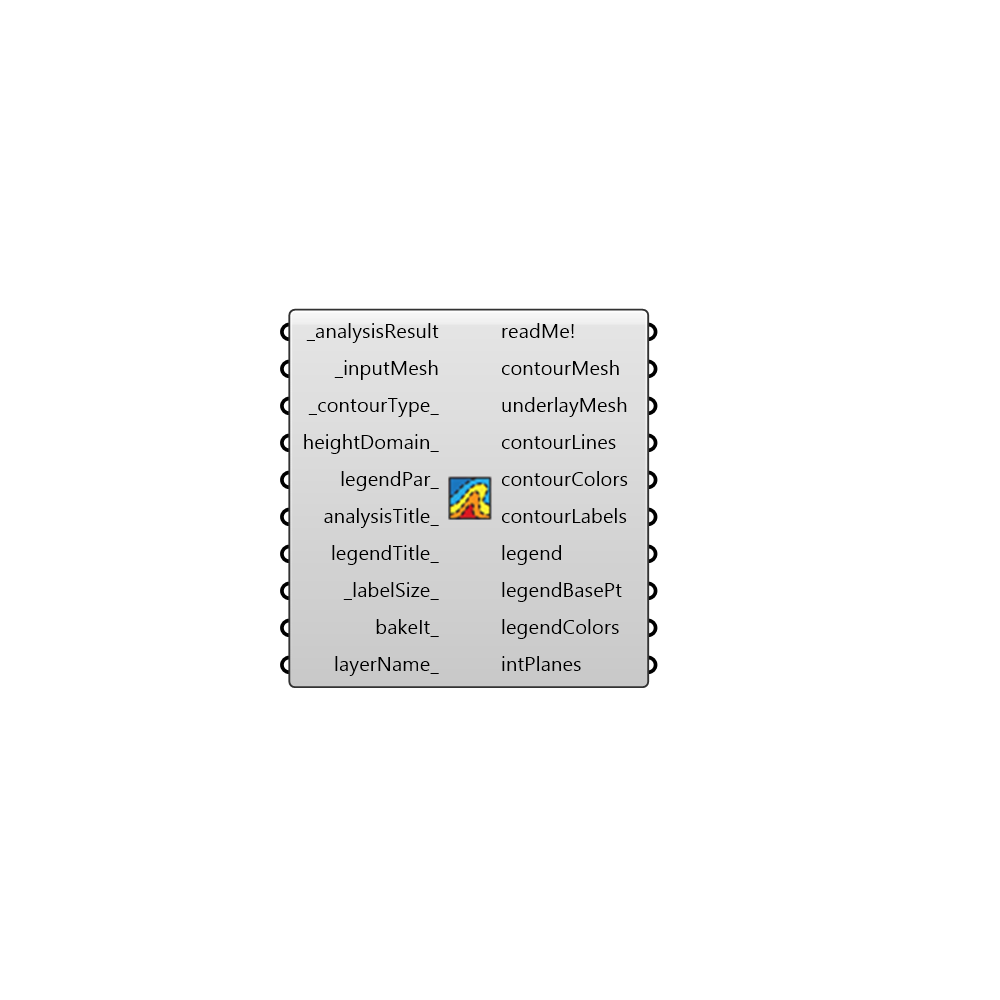

##  Countour Mesh

Use this component to create contoured visualizations of any analysis mesh and corresponding numerical dataset in Ladybug + Honeybee.
 Note that this component currently only works for planar meshes.
 -
 

#### Inputs
* ##### analysisResult [Required]
A numerical data set whose length corresponds to the number of faces in the _inputMesh.  This data will be used to generate contours from the mesh.
* ##### inputMesh [Required]
An already-colored mesh from one of the Ladybug components which you would like to re-color based on data in the _analysisResult.
* ##### contourType [Default]
An integer to set the type of contour visualization.  The default is set to 0 for colored regions.  Choose from the following options:
 0 - Colored Regions + Labeled Lines
 1 - Colored Regions
 2 - Labeled Lines
 3 - Colored Lines
* ##### heightDomain [Optional]
Optional height domain to create a 3D mesh result. Use Construct Domain component to create a domain
* ##### legendPar [Optional]
Optional legend parameters from the Ladybug Legend Parameters component.  Legend Parameters can be used to change the colors, numerical range, and/or number of divisions of any Ladybug legend along with the corresponding colored mesh.
* ##### analysisTitle [Optional]
Text representing a new title for the re-colored mesh.  If no title is input here, the default will read "unnamed."
* ##### legendTitle [Optional]
Text representing a new legend title for re-colored mesh. Legends are usually titled with the units of the _analysisResult.  If no text is provided here, the default title will read "unkown units."
* ##### labelSize [Default]
A number to set the size of the text labels for the contours when _contourType_ 0 or 2 is selected.  The default is auto-calculated based on the size of the mesh.
* ##### bakeIt [Optional]
An integer that tells the component if/how to bake the bojects in the Rhino scene.  The default is set to 0.  Choose from the following options:
 0 (or False) - No geometry will be baked into the Rhino scene (this is the default).
 1 (or True) - The geometry will be baked into the Rhino scene as a colored hatch and Rhino text objects, which facilitates easy export to PDF or vector-editing programs.
 2 - The geometry will be baked into the Rhino scene as colored meshes, which is useful for recording the results of paramteric runs as light Rhino geometry.
* ##### layerName [Optional]
If bakeIt_ is set to "True", input Text here corresponding to the Rhino layer onto which the resulting mesh and legend should be baked.

#### Outputs
* ##### readMe!
...
* ##### contourMesh
A list of colored meshes that is organized with each contour region as its own color.
* ##### underlayMesh
A mesh that is colored face-by-face (like a typical Ladybug mesh), which is plaed under the contour mesh to make the visualization read when the Rhino intersection fails to produce a complete contourMesh.
* ##### contourLines
Curves that show values of constant value along the results.
* ##### contourColors
Connect these to a native Grasshopper Preview componen along with the contourLines to get a colored line visualization.
* ##### contourLabels
A list of text meshes that show the value along each contour line.
* ##### legend
A new legend that that corresponds to the colors of the newMesh. Connect this output to a grasshopper "Geo" component in order to preview this legend separately in the Rhino scene.
* ##### legendBasePt
The legend base point, which can be used to move the legend in relation to the newMesh with the grasshopper "move" component.
* ##### legendColors
A list of colors that correspond to each step in the legend.
* ##### intPlanes
The planes that were used to intersect the mesh to genrate the contours. Set heightDomain_ to a non-zer number to visualize.

[Check Hydra Example Files for Countour Mesh](https://hydrashare.github.io/hydra/index.html?keywords=Ladybug_Countour Mesh)