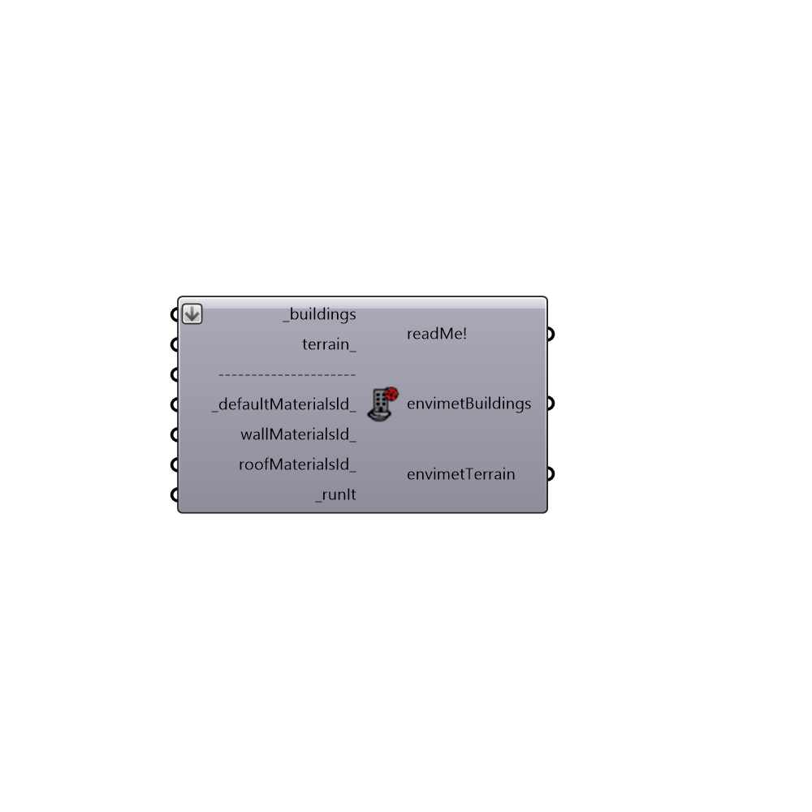

##  ENVI-Met Building Terrain - [[source code]](https://github.com/ladybug-tools/ladybug-legacy/tree/master/src/Ladybug_ENVI-Met%20Building%20Terrain.py)

Use this component to generate inputs for "LB ENVI-Met Spaces".
 -
 Sometimes some buildings are not generated when you connect terrain input. Try to move buildings or move the terrain to solve this issue.
 -
 

#### Inputs
* ##### buildings [Required]
Geometry that represent ENVI-Met buildings.
 -
 Geometry must be closed Brep/Breps.
 -
 Try to connect "threeDeeShapes" output of "Gismo" (a plugin for GIS environmental analysis).
* ##### terrain [Optional]
Optional geometry that represent 
 ENVI-Met terrain. Geometry must be the output of "LB Terrain Generator".
* ##### defaultMaterialsld [Default]
Default wall/roof property. Use this input to set default building materials.
 -
 If no input is connected this input will be concrete slab/roofing tile (00, R1).
* ##### wallMaterialsId [Optional]
Use this input to change wall materials.
* ##### roofMaterialsId [Optional]
Use this input to change roof materials.
* ##### runIt [Required]
Set to "True" to run the component and generate envimetBuildings and envimetTerrain.

#### Outputs
* ##### readMe!
...
* ##### envimetBuildings
Connect this output to "ENVI-Met Spaces" in order to add buildings to ENVI-Met model.
* ##### envimetTerrain
Connect this output to "ENVI-Met Spaces" in order to add a terrain to ENVI-Met model.

[Check Hydra Example Files for ENVI-Met Building Terrain](https://hydrashare.github.io/hydra/index.html?keywords=Ladybug_ENVI-Met Building Terrain)