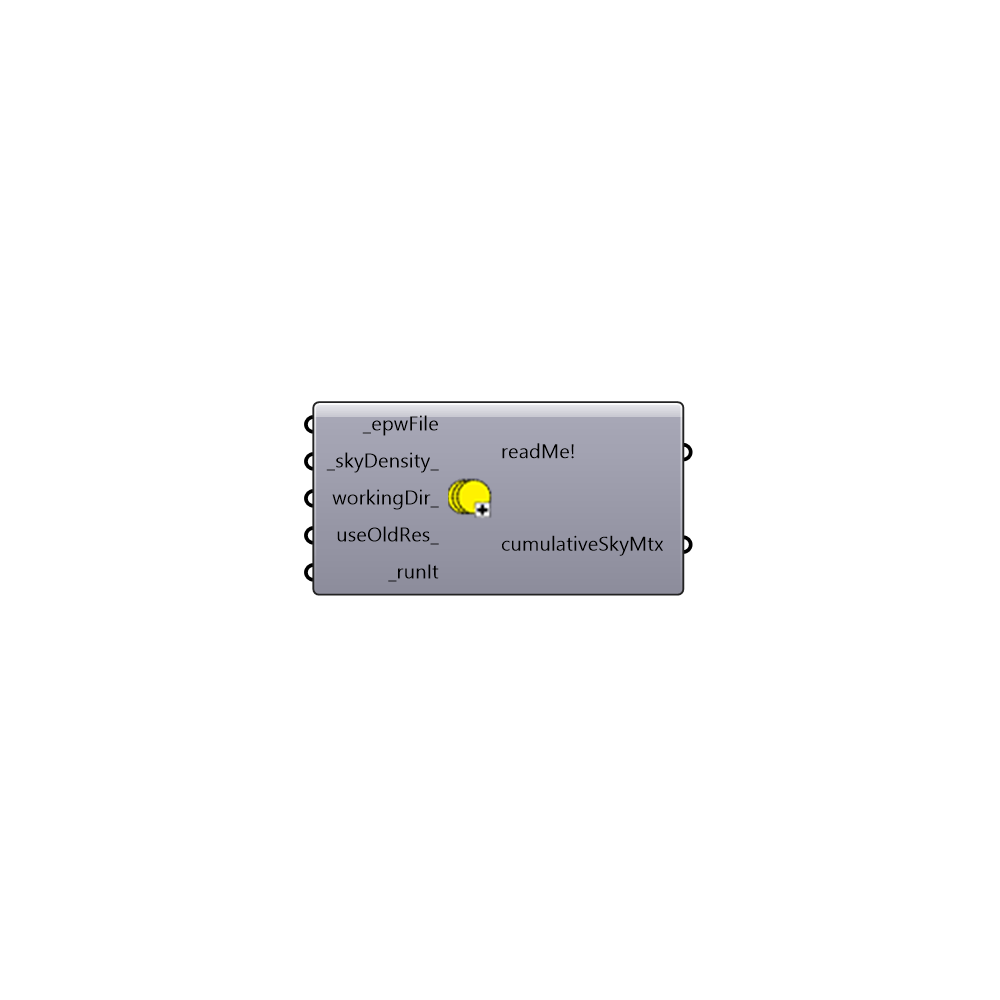

##  GenCumulativeSkyMtx - [[source code]](https://github.com/mostaphaRoudsari/ladybug/tree/master/src/Ladybug_GenCumulativeSkyMtx.py)

This component uses Radiance's gendaymtx function to calculate the sky's radiation for each hour of the year. This is a necessary pre-step before doing radiation analysis with Rhino geometry or generating a radiation rose.
 The first time you use this component, you will need to be connected to the internet so that the component can download the "gendaymtx.exe" function to your system.
 Gendaymtx is written by Ian Ashdown and Greg Ward. For more information, check the Radiance manual at:
 http://www.radiance-online.org/learning/documentation/manual-pages/pdfs/gendaymtx.pdf
 -
 

#### Inputs
* ##### epwFile [Required]
The output of the Ladybug Open EPW component or the file path location of the epw weather file on your system.
* ##### skyDensity [Default]
Set to 0 to generate a Tregenza sky, which will divide up the sky dome with a coarse density of 145 sky patches.  Set to 1 to generate a Reinhart sky, which will divide up the sky dome using a very fine density of 580 sky patches.  Note that, while the Reinhart sky is more accurate, it will result in considerably longer calculation times.  Accordingly, the default is set to 0 for a Tregenza sky.
* ##### workingDir [Optional]
An optional working directory in your system where the sky will be generated. Default is set to C:\Ladybug or C:\Users\yourUserName\AppData\Roaming\Ladybug.  The latter is used if you cannot write to the C:\ drive of your computer.  Any valid file path location can be connected.
* ##### useOldRes [Optional]
Set this to "True" if you have already run this component previously and you want to use the already-generated data for this weather file.
* ##### runIt [Required]
Set to "True" to run the component and generate a sky matrix.

#### Outputs
* ##### readMe!
...
* ##### cumulativeSkyMtx
The result of the gendaymtx function. Use the selectSkyMtx component to select a desired sky matrix from this output for use in a radiation study, radition rose, or sky dome visualization.

[Check Hydra Example Files for GenCumulativeSkyMtx](https://hydrashare.github.io/hydra/index.html?keywords=Ladybug_GenCumulativeSkyMtx)