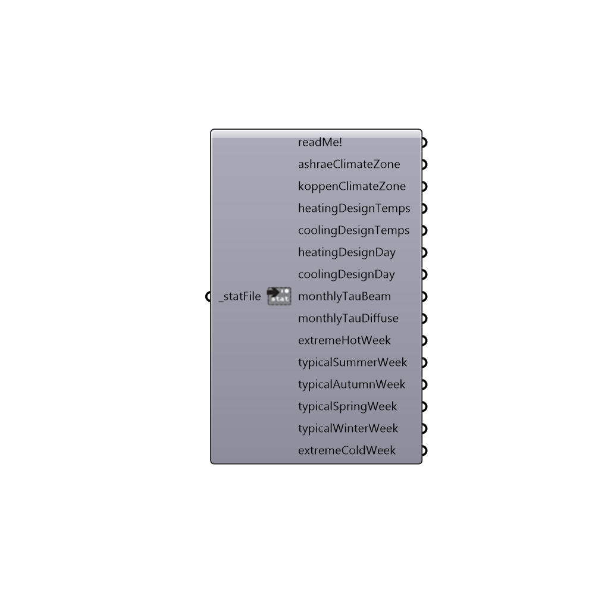

##  Import stat - [[source code]](https://github.com/ladybug-tools/ladybug-legacy/tree/master/src/Ladybug_Import%20stat.py)

Use this component to import climate data found in the .stat file that downloads with the .epw file (in the same .zip folder).
 Sepcifcally, this allows you to import the ASHRAE and Koppen climate zones as well as design temperatures representing the temperature extremes of the climate that should be used to design and size heating and cooling systems.
 Lastly, this component brings in the typical and extreme weeks of the year as ladybug analysis periods that can be plugged into the other ladybug components.
 -
 

#### Inputs
* ##### statFile [Required]
A .stat file path on your system from the Open STAT file component (or typed out as a string).

#### Outputs
* ##### readMe!
The description of ASHRAE anf koppen climate zones. For more information on ASHRAE climate names, please see the PDF at https://www.ashrae.org/File%20Library/docLib/Public/20081111_CZTables.pdf. To know more about koppen climate zones and their definitions, please visit, http://bigladdersoftware.com/epx/docs/8-3/auxiliary-programs/koppen-climate-classification.html and https://en.wikipedia.org/wiki/K%C3%B6ppen_climate_classification
* ##### ashraeClimateZone
The estimated ASHRAE climate zone of the STAT file.  ASHRAE climate zones are frequently used to make suggestions for heating and cooling systems and correspond to recommendations for insulation levels of a building.
* ##### koppenClimateZone
The estimated Koppen climate zone of the STAT file.  The Koppen climate classification is the most widely used climate classification system and is based on the concept that native vegetation is the best expression of climate. Thus, Koppen climate zones combine average annual and monthly temperatures, precipitation, and the seasonality of precipitation.  For more information, see the wikipendia page on Koppen climate: http://en.wikipedia.org/wiki/K%C3%B6ppen_climate_classification.
* ##### heatingDesignTemps
The temperatures in celcius that ASHRAE recommends using to size a heating system to meet a building's sensible heating demand.  The two values output here represent some of the coldest temperatures of the year for which only 0.4% and 1.0% of the hours are below (respectively).
* ##### coolingDesignTemps
The temperatures in celcius that ASHRAE recommends using to size a cooling system to meet a building's sensible cooling demand.  The two values output here represent some of the hottest temperatures of the year for which only 0.4% and 1.0% of the hours are above (respectively).
* ##### heatingDesignDay
An analysis period that represents the day of the year that should be used to size the heating system.
* ##### coolingDesignDay
An analysis period that represents the day of the year that should be used to size the cooling system.
* ##### monthlyTauBeam
Values representing the monthly optical sky depth for beam (direct) solar radiation.  These can be used with the "Ladybug_Design Day Sky" component to create ASHRAE Tau design day solar radiation values.  These values can then be used for sizing HVAC cooling systems.
* ##### monthlyTauDiffuse
Values representing the monthly optical sky depth for diffuse solar radiation.  These can be used with the "Ladybug_Design Day Sky" component to create ASHRAE Tau design day solar radiation values.  These values can then be used for sizing HVAC cooling systems.
* ##### extremeHotWeek
An analysis period representing the hottest week of the typical meteorological year.  If the stat file does not specify an extreme hot week, it is the most extreme week of the hottest season.
* ##### typicalSummerWeek
An analysis period representing a typical week of the hottest season in the typical meteorological year.  Not all stat files specify such a week and, in this case, the output here will be "Null."
* ##### typicalAutumnWeek
An analysis period representing a typical autumn week of the typical meteorological year.
* ##### typicalSpringWeek
An analysis period representing a typical Spring week of the typical meteorological year.  Not all stat files specify such a week and, in this case, the output here will be 'Null.'
* ##### typicalWinterWeek
An analysis period representing a typical week of the coldest season in the typical meteorological year.  Not all stat files specify such a week and, in this case, the output here will be "Null."
* ##### extremeColdWeek
An analysis period representing the coldest week of the typical meteorological year.  If the stat file does not specify an extreme cold week, it is the most extreme week of the coldest season.

[Check Hydra Example Files for Import stat](https://hydrashare.github.io/hydra/index.html?keywords=Ladybug_Import stat)