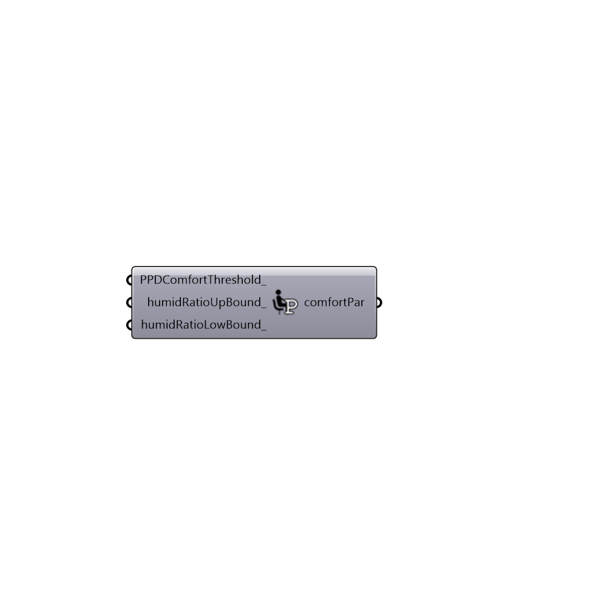

##  PMV Comfort Parameters - [[source code]](https://github.com/mostaphaRoudsari/ladybug/tree/master/src/Ladybug_PMV%20Comfort%20Parameters.py)

Use this component to set PMV comfort parameters for the PMV comfort calculator or the Psychrometric Chart.  
 _
 Parameters include whether comfort is defined by 80 or 90 percent of the occupants comfortable as well as maximum and minimum acceptable humidity ratios.  Note that the applied science and engineering community differs widely on its inderstanding of these parameters.
 _
 The air conditioning industy set out with the goal of satisfying 80% of the occupants (assuming they all had similar clothing and metabolic rates) but many today set 90% as their benchmark.  Also note that, if you try to restrict everyone's clothing and metabolic rate as the PMV model assumed, you can never make 100% of the people comfortable.
 _
 Further note that cultures differ widely in terms of their treatment of humidity at cooler temperatures and lack of humidity.
 -
 

#### Inputs
* ##### PPDComfortThreshold [Optional]
A number between 5 and 100 that represents the percent of people dissatisfied (PPD) at which point a given set of conditions are outside of a comfortable range.  The default is set to 10 percent, which is the typical criteria for both US and European (ISO) standards. However, both of these standards allow an expanded range for infrequenlty-occupied buildings (20% in the US and 15% in Europe) and the European standard requires 6% for 'Class I' buildings.  Note that, if you try to restrict everyone's clothing and metabolic rate as the PMV model assumes, you can never make 100% of the people comfortable.  This is why the smallest acceptable input here is 5%.
* ##### humidRatioUpBound [Optional]
An optional number between 0.012 and 0.030 that limits the maximum humidity ratio acceptable for comfort.  In many cultures and to many people, humidity in conditions of no thermal stress is not considered a source of discomfort and, accordingly, this component does not set an upper limit on humidity by default.  However, for some people, stickyness from humidity in cool conditons is considered uncomfortable and, if you want to account for such a situation, you may want to set an upper limit on the acceptable humidity ratio here.  The ASHRAE 55 PMV comfort standard recommends a maximum humidity of 0.012 kg water/kg air.
* ##### humidRatioLowBound [Optional]
An optional number between 0.000 and 0.005 that limits the minimum humidity ratio acceptable for comfort.  In many cultures, a lack of humidity is not considred uncomfortable since people compensate for its effects by using chap stick and lotions.  Accordingly, this component does not set a lower limit on humidity by default.  However, in some more tropical where people are not accustomed to very dry environments, chaping of lips and drying of skin can occur more easily and, if you want to account for such a situation, you may want to set a lower limit on the acceptable humidity ratio here. The ASHRAE 55 PMV comfort recommends no lower limit on humidity.

#### Outputs
* ##### comfortPar
Comfort parameters that you can plug into either the "Ladybug_PMV Comfort Calculator" or the "Ladybug_Psychrometric Chart."

[Check Hydra Example Files for PMV Comfort Parameters](https://hydrashare.github.io/hydra/index.html?keywords=Ladybug_PMV Comfort Parameters)