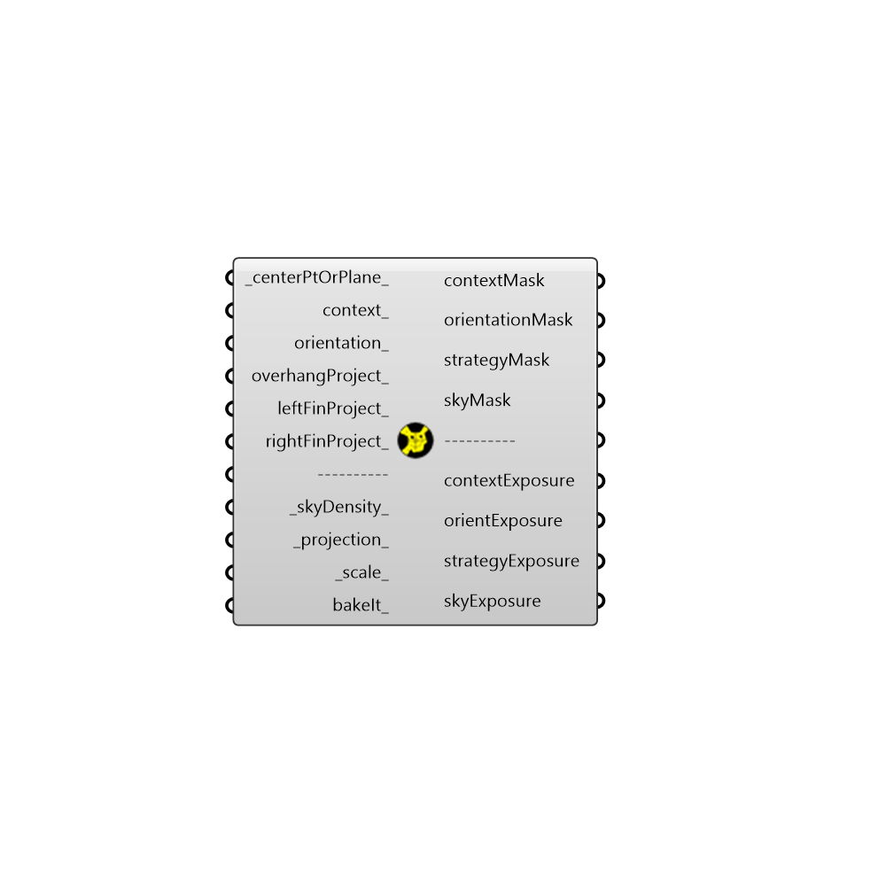

##  Shading Mask - [[source code]](https://github.com/ladybug-tools/ladybug-legacy/tree/master/src/Ladybug_Shading%20Mask.py)

Use this component to see the portion of the sky dome that is masked by context geometry around a given point.
 The component will generate separate meshs for the portions of the sky dome that are masked and visible.
 The component will also calculate the percentage of the sky that is masked by the context geometry and the percentage that is visible (the sky view factor).
 -output
 

#### Inputs
* ##### centerPtOrPlane [Default]
A point or plane from which the visible portion of the sky will be evaluated.  If a point is input here, the component will calculate Sky Exposure (or the fraction of the sky hemisphere that is visible from the point).  If a plane is input here, the component will calculate Sky View (or the fraction of the sky visible from a surface in this plane).  If no value is input here, the component will assume a point (Sky Exposure) at the Rhino origin.
* ##### context [Optional]
Context geometry surrounding the _centerPtOrPlane_ that could block the view to the sky.  Geometry can be either a list of surfaces, breps, or meshes (this component converts everything to a mesh for a fast calculation).
* ##### orientation [Optional]
A number between 0 and 360 that sets the orientation of a vertically-oriented surface for which you want to visualize the sky view.  Alternatively, this input can just be the words "north", "east", "south" or "west."  This will block out the portion of the sky that is not visible from a vertical surface with this orientation. Note that an input here will project the patches into the plane of this vertical orientation to calculate a Sky View result (overriding any plane input to the _centerPtOrPlane_).  The default is set to have no orientation.
* ##### overhangProject [Optional]
A number between 0 and 90 that sets the angle between the _centerPtOrPlane_ and the edge of an imagined horizontal overhang projecting past the point.  Note that this option is only available when there is an input for orientation_ above. This allows one to visualise the portion of the sky blocked by an overhang with this projection anle.
* ##### leftFinProject [Optional]
A number between 0 and 180 that sets the angle between the _centerPtOrPlane_ and the edge of an imagined vertical fin projecting past the left side of the point.  Note that this option is only available when there is an input for orientation_ above. This allows one to visualise the portion of the sky blocked by vertical fin on the left side of the point with this projection anle.
* ##### rightFinProject [Optional]
A number between 0 and 180 that sets the angle between the _centerPtOrPlane_ and the edge of an imagined vertical fin projecting past the right side of the point.  Note that this option is only available when there is an input for orientation_ above. This allows one to visualise the portion of the sky blocked by vertical fin on the right side of the point with this projection anle.
* ##### skyDensity [Default]
An integer that is greater than or equal to 0, which to sets the number of times that the Tergenza sky patches are split.  Set to 0 to view a sky mask with the typical Tregenza sky, which will divide up the sky with a coarse density of 145 sky patches.  Higher numbers input here will ensure a greater accuracy but will also take longer. The default is set to 3 to give you an error that is usually less than 1% sky view.  It is recommended that you use values of 3 or above for accurate results.
* ##### projection [Default]
A number to set the projection of the sky hemisphere.  The default is set to draw a 3D hemisphere.  Choose from the following options:
 0 = 3D hemisphere
 1 = Orthographic (straight projection to the XY Plane)
 2 = Stereographic (equi-angular projection to the XY Plane)
* ##### scale [Default]
Use this input to change the scale of the sky dome.  The default is set to 1.
* ##### bakeIt [Optional]
An integer that tells the component if/how to bake the bojects in the Rhino scene.  The default is set to 0.  Choose from the following options:
 0 (or False) - No geometry will be baked into the Rhino scene (this is the default).
 1 (or True) - The geometry will be baked into the Rhino scene as a colored hatch and Rhino text objects, which facilitates easy export to PDF or vector-editing programs.
 2 - The geometry will be baked into the Rhino scene as colored meshes, which is useful for recording the results of paramteric runs as light Rhino geometry.

#### Outputs
* ##### contextMask
A mesh of the portion of the sky dome masked by the context_ geometry.
* ##### orientationMask
A mesh of the portion of the sky dome masked by the fact that a surface is facing a given orientation.
* ##### strategyMask
A mesh of the portion of the sky dome masked by the overhang, left fin, and right fin projections.
* ##### skyMask
A mesh of the portion of the sky dome visible by the _centerPtOrPlane_ through the context_ geometry.
* ##### contextExposure
The percentage of the hemispherical sky dome masked by the context_ geometry.
* ##### orientExposure
The percentage of the hemispherical sky dome masked by the fact that a surface is facing a given orientation.
* ##### strategyExposure
The percentage of the hemispherical sky dome masked by the overhang, left fin, and right fin projections.
* ##### skyExposure
The percentage of the hemispherical sky dome visible through the context_ geometry and the strategy geometry.

[Check Hydra Example Files for Shading Mask](https://hydrashare.github.io/hydra/index.html?keywords=Ladybug_Shading Mask)