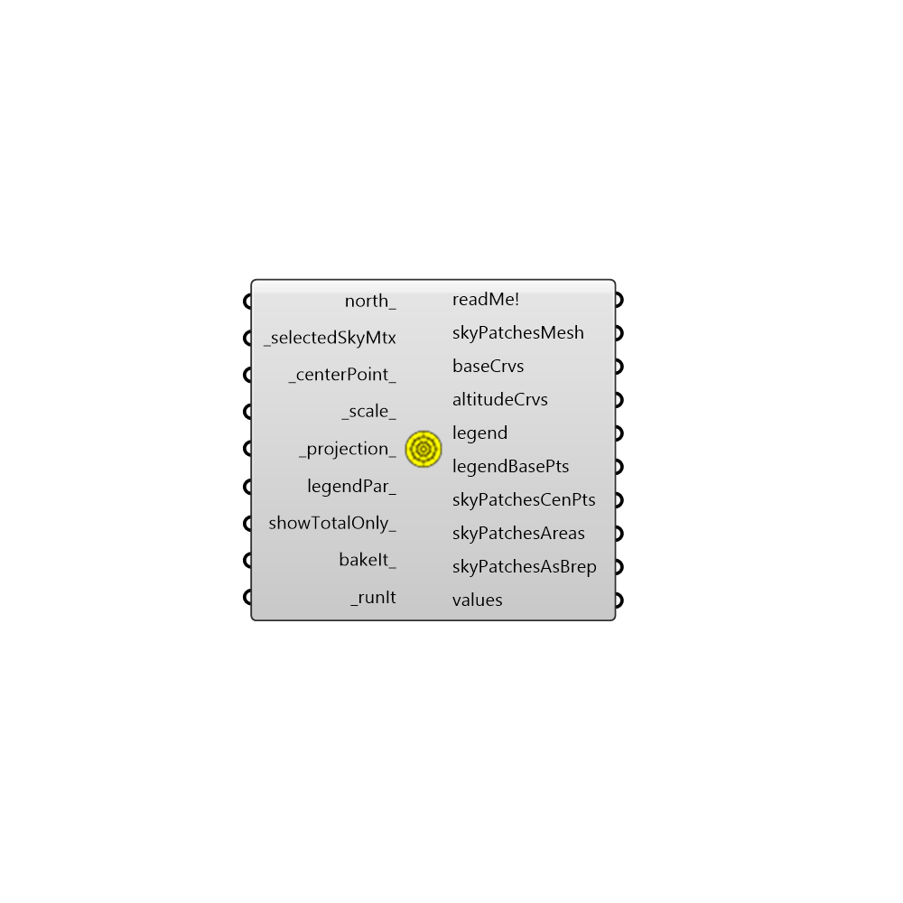

##  Sky Dome - [[source code]](https://github.com/ladybug-tools/ladybug-legacy/tree/master/src/Ladybug_Sky%20Dome.py)

This component allows you to visualize a selected sky matrix from the selectSkyMxt component in order to see the patches of the sky dome where radiation is coming from.
 The component will produce 3 sky domes by default: a dome showing just the diffuse radiation, a dome showing just the direct radiation, and a dome showing the total radiation.
 -
 

#### Inputs
* ##### north [Optional]
Input a vector to be used as a true North direction for the sun path or a number between 0 and 360 that represents the degrees off from the y-axis to make North.  The default North direction is set to the Y-axis (0 degrees).
* ##### selectedSkyMtx [Required]
The output from the selectSkyMtx component.
* ##### centerPoint [Default]
A point that sets the location of the sky domes.  The default is set to the Rhino origin (0,0,0).
* ##### scale [Default]
Use this input to change the scale of the sky dome.  The default is set to 1.
* ##### projection [Default]
A number to set the projection of the sky hemisphere.  The default is set to draw a 3D hemisphere.  Choose from the following options:
 0 = 3D hemisphere
 1 = Orthographic (straight projection to the XY Plane)
 2 = Stereographic (equi-angular projection to the XY Plane)
* ##### legendPar [Optional]
Optional legend parameters from the Ladybug Legend Parameters component.
* ##### showTotalOnly [Optional]
Set to "True" to only show a sky dome with the total radiation.  The default is "False", which will produce 3 sky domes: one of diffuse radiation, one of direct radiation, and one of the total radiation.
* ##### bakeIt [Optional]
An integer that tells the component if/how to bake the bojects in the Rhino scene.  The default is set to 0.  Choose from the following options:
 0 (or False) - No geometry will be baked into the Rhino scene (this is the default).
 1 (or True) - The geometry will be baked into the Rhino scene as a colored hatch and Rhino text objects, which facilitates easy export to PDF or vector-editing programs.
 2 - The geometry will be baked into the Rhino scene as colored meshes, which is useful for recording the results of paramteric runs as light Rhino geometry.
* ##### runIt [Required]
Set to "True" to run the component and generate a sky dome.

#### Outputs
* ##### readMe!
...
* ##### skyPatchesMesh
A colored mesh representing the intensity of radiation for each of the sky patches of the sky dome.
* ##### baseCrvs
A set of guide curves that mark information on the sky dome.
* ##### altitudeCrvs
A set of circular curves that denote the altitude.  Note that these will only appear when the _projection_ is set to something other than a 3D sun path.
* ##### legend
A legend for the sky dome. Connect this output to a grasshopper "Geo" component in order to preview the legend separately in the Rhino scene.
* ##### legendBasePts
The legend base point(s), which can be used to move the legend(s) in relation to the sky domes with the grasshopper "move" component.
* ##### skyPatchesCenPts
The center points of sky patches, which can be used to shape Rhino geometry in relation to radiation from different sky patches.
* ##### skyPatchesAreas
The area of sky patches in Rhino model units.
* ##### skyPatchesAsBrep
The geometry of sky patches as breps.
* ##### values
Radiation values for the sky patches in kWh/m2.

[Check Hydra Example Files for Sky Dome](https://hydrashare.github.io/hydra/index.html?keywords=Ladybug_Sky Dome)