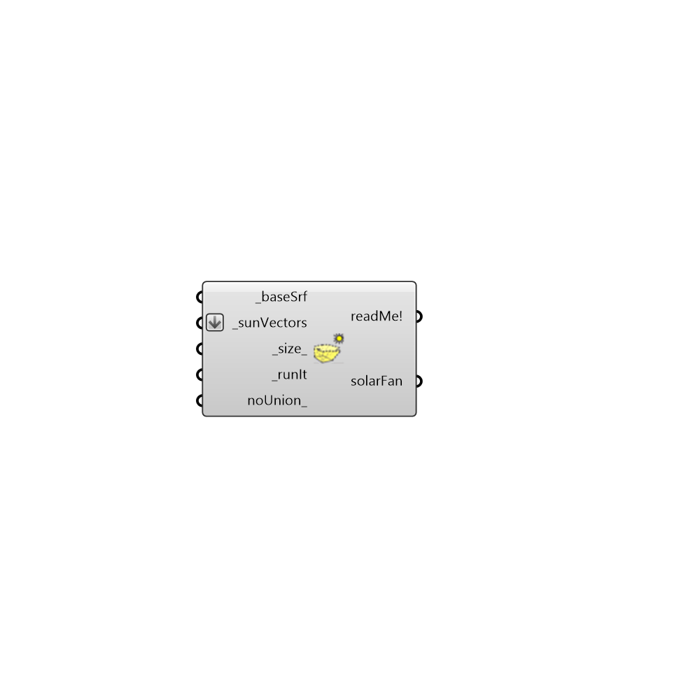

##  SolarFan - [[source code]](https://github.com/ladybug-tools/ladybug-legacy/tree/master/src/Ladybug_SolarFan.py)

Use this component to generate a solar fan for a given test surface and set of solar vectors.  Solar fans essentially illustrate the volume that should be clear of shading in order to provide solar access to a test surface for a given set of sun vectors.
 Solar fans are typically used to ensure solar access for park vegetation in the midst of large developments constructed around it.  It can be also used to ensure solar access for windows that might want to use the sun for heating for ceratin hours of the year.
 -
 

#### Inputs
* ##### baseSrf [Required]
A surface representing a piece of land (such as a park) or a window for which solar access is desired.
* ##### sunVectors [Required]
Sun vectors representing hours of the year when sun should be accessible to the baseSrf. sunVectors can be generated using the Ladybug sunPath component.
* ##### size [Default]
Input a number here to change how far the solar fan extends from the _baseSrf.  The default is set to 1, which will produce a solar fan that is half as tall as the longest side of the _baseSrf. Note that increasing the height too high can cause the fan to break up into multiple fans due to the resolution of the solar vectors.
* ##### runIt [Required]
Set to "True" to run the analysis and generate a solar fan. Note that, for more than 500 sunVectors, calculation times can take more than a half-minute.
* ##### noUnion [Optional]
By default this component will attempt to boolean union all the solar fans created, sometimes the underlying boolean union rhino operation fails and as a result only some of the solar fans are created.
 When this happens you can set this input to false and the boolean union operation will not be performed on the solar fans ensuring that all solar fans will be created.

#### Outputs
* ##### readMe!
...
* ##### solarFan
Brep representing a solar fan that should be clear of shading in order to ensure solar access to the _baseSrf for the given _sunVectors.

[Check Hydra Example Files for SolarFan](https://hydrashare.github.io/hydra/index.html?keywords=Ladybug_SolarFan)