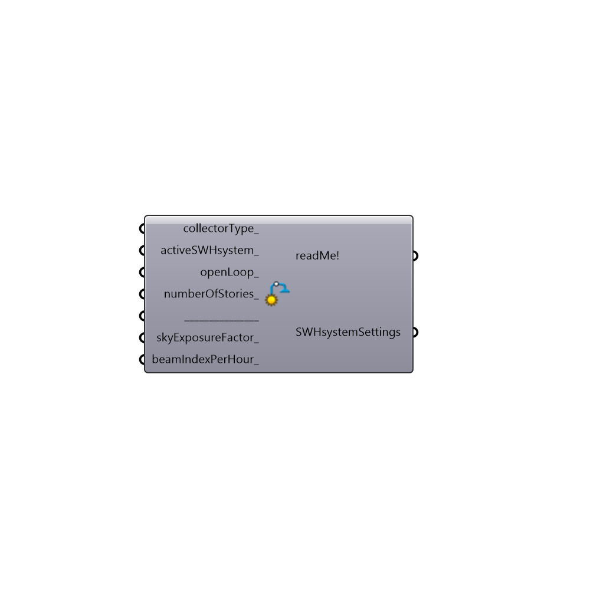

##  Solar Water Heating System - [[source code]](https://github.com/mostaphaRoudsari/ladybug/tree/master/src/Ladybug_Solar%20Water%20Heating%20System.py)

Use this component to define Solar water heating system settings.
 -
 If nothing inputed, the following swh system will be used by default:
 - glazed flat plate collectors
 - active
 - closed loop
 - 1 story
 - unshaded
 -
 

#### Inputs
* ##### collectorType [Optional]
Type of the collector. The following ones can be used:
 -
 0 - unglazed flat plate
 Least expensive.
 Mostly used for single home domestic how water heating and for heating swimming pools.
 More cost efficient in tropical and subtropical environments. They can also be used in moderate climates for seasonal usage.
 Can output water temperatures up to 30°C (86°F).
 -
 1 - glazed flat plate
 Less expensive.
 More cost efficient in warm and mild-warm climates. But also used in temperate climates.
 Mostly used for single home domestic how water heating, space heating and space cooling. And for heating swimming pools.
 Can output water temperatures up to 60°C (140°F).
 -
 2 - evacuated tube
 The most expensive.
 More cost efficient in cold temperate and cold climates (with low ambient temperature, for example: during winter) and during overcast skies.
 Evacuated tube collectors (or concentrating collectors) are typically used for industrial applications, or multi residential or commercial buildings for space heating and space cooling.
 Can output water temperatures higher than 90°C (194°F) degrees, up to 177°C (350°F).
 -
 -
 If not supplied, glazed flat plate collectors (1) will be used.
* ##### activeSWHsystem [Optional]
Define whether the swh system is active (pumped) or passive (not pumped).
 -
 0 - passive (not pumped) swh system
 Less expensive.
 More efficient in warm and mild-warm climates.
 Does not require electricity to operate.
 Is used for domestic hot water heating and space heating of a single home.
 If positioned on a roof require putting a storage tank above the collector, and therefor impose the roof construction to be able to carry the weight of the storage tank.
 SWHsurface component supports passive swh systems with auxiliary heater.
 -
 1 - active (pumped) swh system
 More expensive.
 More efficient in temperate and cold climates.
 Require electricity to operate and battery back-up in case of power outage.
 Can be used for domestic hot water heating, space heating and space cooling of a single home, building or several buildings (central heating).
 More efficient in warm and mild-warm climates, where it rarely freezes
 -
 -
 If not supplied, active (pumped) loop will be used.
* ##### openLoop [Optional]
Define whether the swh system has an open (indirect) or closed (indirect) solar loop.
 -
 0 - closed (indirect) loop
 Usage of heatexchanger. Antifreeze is a working fluid.
 More expensive.
 More efficient in temperate and cold climates where freezing may occur.
 Also suitable for locations with hard water hardness (mineral content).
 -
 1 - open (direct) loop
 No usage of heatexchangers. Water is the working fluid.
 Less expensive.
 More efficient in warm and mild-warm climates, where it rarely freezes (air temperature never drops below 5°C(41°F) degrees).
 Only suitable for locations with low water hardness (mineral content) otherwise limescale will form in solar collectors.
 -
 -
 If not supplied, closed (indirect) loop will be used.
* ##### numberOfStories [Optional]
Total number of stories plus basement (if there is a basement).
 This input is used to calculate the total piping length in the solar loop, based on an assumption that the storage tank will be located at the lowest story (basement or ground floor), and solar collectors are located at the roof.
 -
 Example 1:
 a house with a ground floor, first floor and a basement - has 3 stories total.
 Example 2:
 a house with a ground floor, first floor, second floor and without a basement - has 3 stories total.
 -
 If sollar collectors are used on a ground instead of roof, use the "Solar Water Heating System Detailed" component instead of this one to enter the exact pipe length of the solar loop.
 -
 -
 If not supplied, "1" story will be used as a default value (a house with only a ground floor, without a basement).
* ##### skyExposureFactor [Optional]
Continuous Sky Exposure Factor - portion of the visible sky (dome). It defines the shading of the diffuse irradiance components. It ranges from 0 to 1.
 Import it from "Sunpath shading" component's "skyExposureFactor" output.
 -
 If not supplied, 1 will be used as a default value (SWHsurface is unshaded).
 -
 Unitless.
* ##### beamIndexPerHour [Optional]
Transmission index of beam (direct) irradiance for each hour during a year. It ranges from 0-1.
 Import it from "Sunpath shading" component's "beamIndexPerHour" output.
 -
 If not supplied, a value of 1 for each hour during a year, will be used (SWHsurface is unshaded).
 -
 Unitless.

#### Outputs
* ##### readMe!
...
* ##### SWHsystemSettings
A list of all Solar water heating system settings. Plug it to SWHsurface component's "SWHsystemSettings_" input.

[Check Hydra Example Files for Solar Water Heating System](https://hydrashare.github.io/hydra/index.html?keywords=Ladybug_Solar Water Heating System)