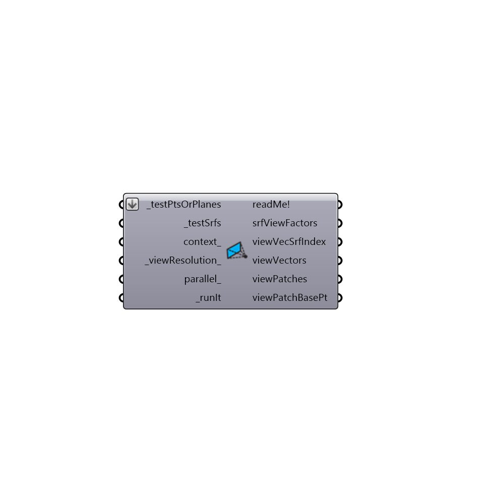

##  Surface View Analysis - [[source code]](https://github.com/mostaphaRoudsari/ladybug/tree/master/src/Ladybug_Surface%20View%20Analysis.py)

Use this component to calculate view factors from a point or plane to a set of surfaces.  View factors are used in many thermal comfort calculations such as mean radiant temperture (MRT) or discomfort from radiant assymetry. 
 -
 

#### Inputs
* ##### testPtsOrPlanes [Required]
A point or plane from which view vectors will be pojected.  Note that, if a point is connected, all view vectors will be weighted evenly (assuming no directional bias).  However, if a plane is connected, vectors will be weighted based on their angle to the plane normal, producing view factors for a surface in the connected plane.  The first is useful for MRT calculations while the latter is needed for radiant assymetry calculations.  This input can also be a list of points or planes.
* ##### testSrfs [Required]
A list of breps, surfaces, or meshes to which you want to compute view factors.  Note that by meshing and joining several goemtries together, you can calculate the combined view factor to these geometries.
* ##### context [Optional]
Optional context geometry as breps, surfaces, or meshes that can block the view to the _testSrfs.
* ##### viewResolution [Default]
An interger, which sets the number of times that the tergenza skyview patches are split.  A higher number will ensure a greater accuracy but will take longer.  The default is set to 0 for a quick calculation.
* ##### parallel [Optional]
Set to "True" to run the calculation in parallel and set to "False" to run it with a single core.  The default is set to "False."
* ##### runIt [Required]
Set to 'True' to run the component and claculate view factors.

#### Outputs
* ##### readMe!
...
* ##### srfViewFactors
A list of view factors that describe the fraction of sperical view taken up by the input surfaces.  These values range from 0 (no view) to 1 (full view).  If multiple _testPtsOrPlanes have been connected, this output will be a data tree with one list for each point.
* ##### viewVecSrfIndex
The index of the surface that each view vector hit.  This can be used to identify which view pathces are intersected by each surface.  If no surfaces are intersected, this value will be -1.
* ##### viewVectors
The view vectors that were projected from each testPtOrPlane.
* ##### viewPatches
The patches of the sphere that each view vector correspond to.
* ##### viewPatchBasePt
The center of the viewPatches sphere. This can be used to move the view patches between the testPts.

[Check Hydra Example Files for Surface View Analysis](https://hydrashare.github.io/hydra/index.html?keywords=Ladybug_Surface View Analysis)